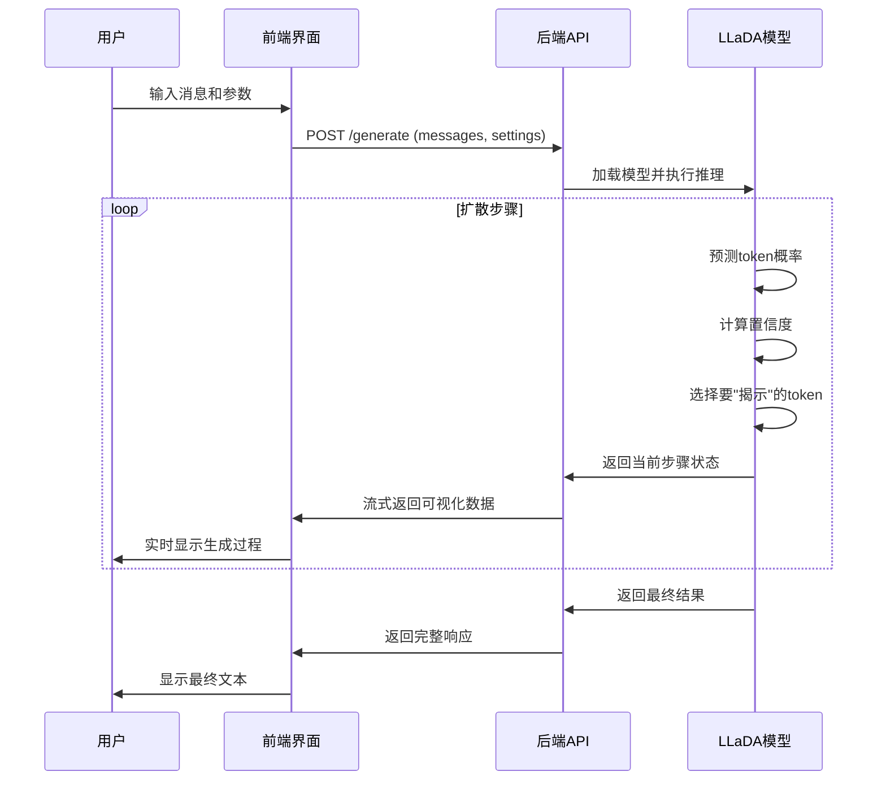

# LLaDA 扩散语言模型可视化系统 - 工作原理详解

## 项目概述

LLaDA(Large Language model Diffusion Architecture)扩散语言模型可视化系统是一个创新的前后端分离架构应用，专门用于展示和可视化扩散语言模型的生成过程。系统采用React.js构建前端界面，Flask提供后端API服务，核心基于PyTorch和Transformers实现的LLaDA扩散语言模型。

## 核心技术架构

### 1. 系统架构图

```
┌─────────────────┐    HTTP/REST API    ┌──────────────────┐
│   前端界面      │◄──────────────────►│   后端服务器     │
│   (React.js)    │                    │   (Flask)        │
│   Port: 3000    │                    │   Port: 5000     │
└─────────────────┘                    └──────────────────┘
                                                │
                                                ▼
                                       ┌──────────────────┐
                                       │   LLaDA模型      │
                                       │   (PyTorch)      │
                                       │   /root/autodl-  │
                                       │   tmp/model      │
                                       └──────────────────┘
```

### 2. 技术栈详解

#### 前端技术栈
- **React 18.2.0**: 用户界面库，提供组件化开发
- **Axios**: HTTP客户端，处理前后端通信
- **CSS3**: 样式和动画，包括扩散过程可视化
- **ES6+**: 现代JavaScript特性

#### 后端技术栈
- **Flask**: 轻量级Web框架，提供RESTful API
- **PyTorch**: 深度学习框架，模型推理
- **Transformers**: HuggingFace模型库，模型加载和处理
- **Flask-CORS**: 跨域支持

#### 模型架构
- **LLaDA**: 基于扩散算法的语言模型
- **BERT-like架构**: 双向注意力机制
- **扩散生成**: 从噪声到文本的逐步去噪过程

## 核心工作原理

### 1. 扩散语言模型原理

#### 1.1 传统语言模型 vs 扩散语言模型

**传统自回归模型**:
```
Input: "你好" → "你好，" → "你好，今天" → "你好，今天天气"
      (逐词生成，单向依赖)
```

**扩散语言模型**:
```
Step 0: [MASK] [MASK] [MASK] [MASK] [MASK]
Step 1: [MASK] [MASK] 天气  [MASK] [MASK]
Step 2: [MASK] 今天  天气  [MASK] [MASK]
Step 3: 你好  今天  天气  很好  [MASK]
Step 4: 你好  今天  天气  很好  呢
       (并行生成，双向依赖)
```

#### 1.2 扩散过程详解

**前向过程（加噪）**:
1. 从完整文本开始
2. 逐步将tokens替换为[MASK]
3. 最终得到全[MASK]序列

**反向过程（去噪）**:
1. 从全[MASK]序列开始
2. 逐步预测并替换[MASK]
3. 最终得到完整文本

**数学表示**:
```python
# 前向过程
x_t = mask_schedule(x_0, t, noise)

# 反向过程  
x_{t-1} = model_predict(x_t, t) + noise_schedule(t)
```

### 2. 系统工作流程

#### 2.1 用户交互流程



#### 2.2 数据流详解

**前端到后端**:
```json
{
    "messages": [
        {"role": "user", "content": "你好，今天天气怎么样？"}
    ],
    "settings": {
        "gen_length": 64,
        "steps": 32,
        "temperature": 0.0,
        "cfg_scale": 0.0,
        "constraints": "0:天气, 5:不错"
    }
}
```

**后端到前端**:
```json
{
    "response": "天气今天很不错，阳光明媚。",
    "visualization": [
        [
            ["[MASK]", "#444444"],
            ["[MASK]", "#444444"],
            ["[MASK]", "#444444"]
        ],
        [
            ["天气", "#66CC66"],
            ["[MASK]", "#444444"], 
            ["[MASK]", "#444444"]
        ]
    ]
}
```

### 3. 核心算法实现

#### 3.1 扩散生成算法

```python
def generate_response(messages, settings):
    # 1. 初始化序列
    x = torch.full((1, gen_length), MASK_ID)
    
    # 2. 分步生成
    for step in range(steps):
        # 预测概率分布
        logits = model(x).logits
        
        # 添加噪声（可选）
        if temperature > 0:
            logits = add_gumbel_noise(logits, temperature)
        
        # 计算最可能的token
        x0 = torch.argmax(logits, dim=-1)
        
        # 计算置信度
        confidence = F.softmax(logits, dim=-1)
        x0_confidence = torch.gather(confidence, -1, x0.unsqueeze(-1))
        
        # 选择要保留的token（重要创新点）
        num_to_keep = calculate_keep_tokens(step, total_steps)
        keep_indices = torch.topk(x0_confidence, num_to_keep).indices
        
        # 更新序列
        x = update_sequence(x, x0, keep_indices)
        
        # 记录可视化状态
        visualization_steps.append(create_vis_state(x, confidence))
    
    return decode(x), visualization_steps
```

#### 3.2 置信度计算

```python
def calculate_confidence(logits, predicted_tokens):
    # Softmax归一化
    probs = F.softmax(logits, dim=-1)
    
    # 获取预测token的概率作为置信度
    confidence = torch.gather(probs, -1, predicted_tokens.unsqueeze(-1))
    
    return confidence.squeeze(-1)
```

#### 3.3 重新masking策略

系统支持多种重新masking策略：

**低置信度策略**:
```python
if remasking == 'low_confidence':
    # 保留高置信度token，重新mask低置信度token
    keep_mask = confidence > confidence_threshold
```

**随机策略**:
```python
if remasking == 'random':
    # 随机选择保留的token
    keep_mask = torch.rand_like(confidence) > random_threshold
```

### 4. 可视化原理

#### 4.1 颜色编码系统

```javascript
function getConfidenceColor(confidence) {
    if (confidence === 0) return '#666';      // 灰色 - [MASK]
    if (confidence < 0.3) return '#FF6666';  // 红色 - 低置信度
    if (confidence < 0.7) return '#FFAA33';  // 橙色 - 中置信度
    return '#66CC66';                        // 绿色 - 高置信度
}
```

#### 4.2 动画原理

```css
.token {
    transition: all 0.3s ease-in-out;
    animation: tokenReveal 0.5s ease-out;
}

@keyframes tokenReveal {
    from {
        opacity: 0;
        transform: scale(0.8);
        background: #ffeb3b;
    }
    to {
        opacity: 1;
        transform: scale(1);
    }
}
```

### 5. 约束生成原理

#### 5.1 约束格式

用户可以指定特定位置必须生成的词：
```
格式: "位置:词语, 位置:词语"
示例: "0:天气, 5:不错, 10:!"
```

#### 5.2 约束实现

```python
def apply_constraints(x, constraints, prompt_length):
    for pos, word in constraints.items():
        # 将词语转换为token
        tokens = tokenizer.encode(" " + word, add_special_tokens=False)
        
        # 在指定位置强制设置token
        for i, token_id in enumerate(tokens):
            abs_pos = prompt_length + pos + i
            if abs_pos < x.shape[1]:
                x[:, abs_pos] = token_id
    
    return x
```

### 6. 性能优化

#### 6.1 批处理优化

```python
# 支持批量处理多个样本
batch_size = settings.get('batch_size', 1)
x = torch.full((batch_size, gen_length), MASK_ID)
```

#### 6.2 GPU加速

```python
device = 'cuda' if torch.cuda.is_available() else 'cpu'
model = model.to(device)
x = x.to(device)
```

#### 6.3 内存优化

```python
# 使用半精度计算
model = model.half()
# 梯度检查点
torch.cuda.empty_cache()
```

### 7. 系统扩展性

#### 7.1 模型插件化

系统设计支持不同的扩散语言模型：
```python
class DiffusionModelBase:
    def generate(self, input_ids, settings):
        raise NotImplementedError
        
class LLaDAModel(DiffusionModelBase):
    def generate(self, input_ids, settings):
        # LLaDA特定实现
        pass
```

#### 7.2 可视化插件

```javascript
class VisualizationPlugin {
    render(tokens, confidences) {
        // 自定义可视化实现
    }
}
```

## 创新特点

### 1. 技术创新

1. **扩散过程可视化**: 首次实现扩散语言模型生成过程的实时可视化
2. **置信度展示**: 通过颜色编码直观展示模型的不确定性
3. **交互式约束**: 用户可实时指定生成约束条件
4. **分块生成**: 支持长文本的分块并行生成

### 2. 用户体验创新

1. **实时反馈**: 用户可观察每一步的生成过程
2. **参数调节**: 支持实时调整生成参数
3. **约束控制**: 灵活的位置约束系统
4. **响应式界面**: 适配不同屏幕尺寸

### 3. 教育价值

1. **算法透明**: 让用户理解扩散模型工作原理
2. **参数影响**: 直观展示不同参数对生成结果的影响
3. **概率理解**: 通过置信度帮助理解模型的不确定性

## 应用场景

### 1. 研究用途
- 扩散语言模型研究
- 生成质量评估
- 算法改进验证

### 2. 教育用途
- 深度学习教学
- NLP概念演示
- 概率模型理解

### 3. 开发用途
- 模型调试
- 参数优化
- 生成质量测试

## 技术挑战与解决方案

### 1. 实时性挑战
**问题**: 扩散过程计算复杂，需要多步推理
**解决方案**: 
- GPU加速计算
- 异步处理
- 流式返回结果

### 2. 可视化挑战
**问题**: 大量token的实时渲染性能
**解决方案**:
- 虚拟滚动
- 延迟渲染
- 动画优化

### 3. 内存挑战
**问题**: 大模型内存占用
**解决方案**:
- 模型量化
- 动态加载
- 内存回收

这个系统代表了扩散语言模型可视化领域的一个重要进展，为研究者和开发者提供了一个强大的工具来理解和改进扩散语言模型。
