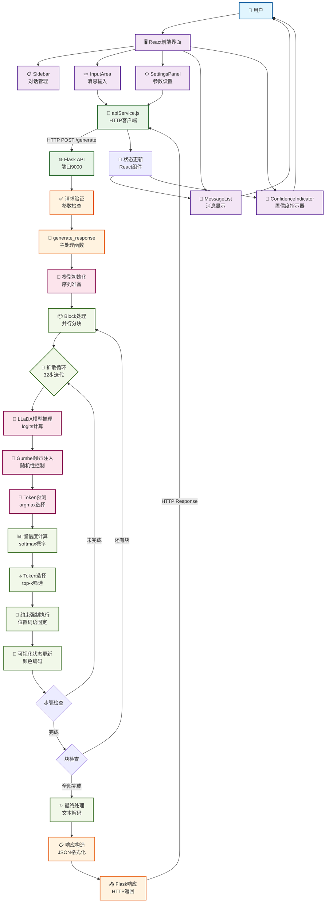
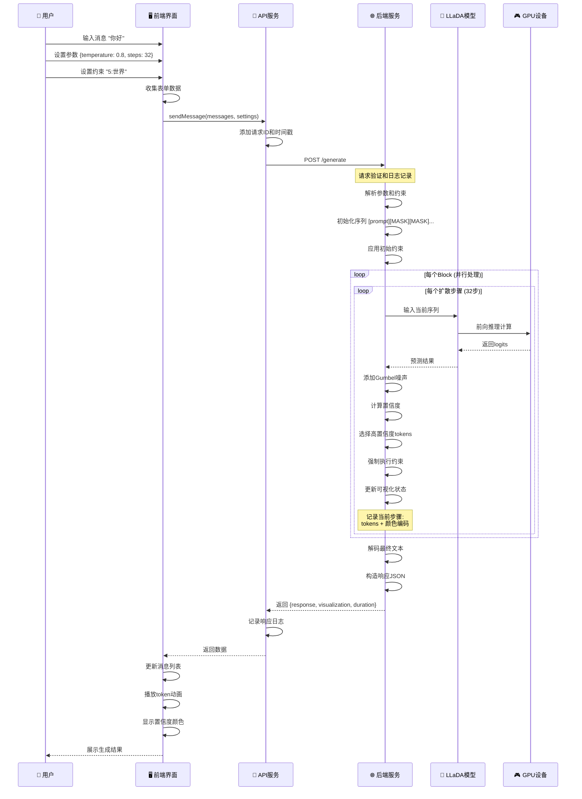
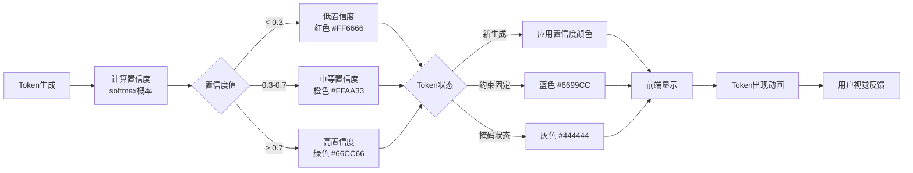
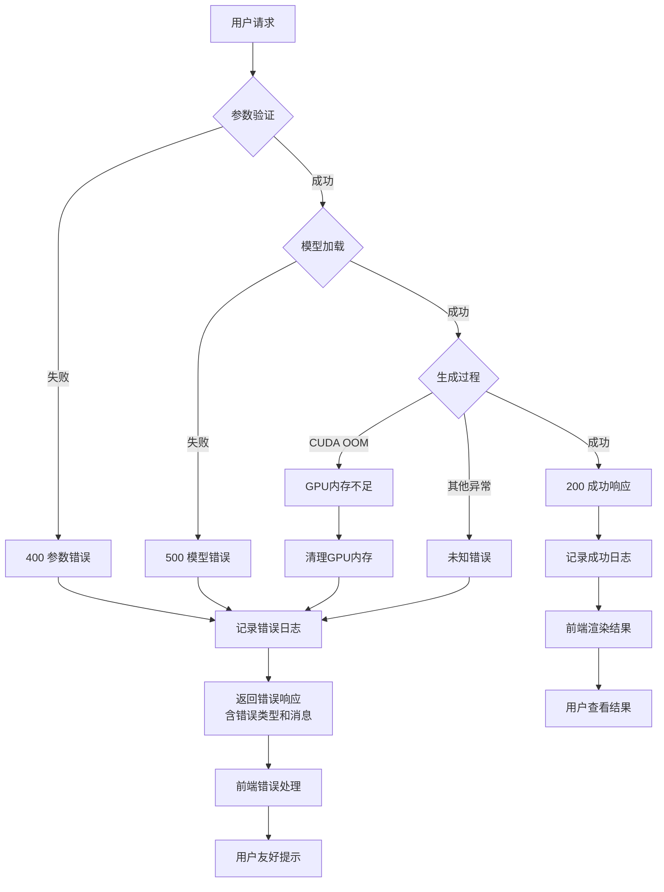

# LLaDA系统流程图

## 系统整体架构流程图



## 详细数据流转图



## 核心算法流程图

```mermaid
flowchart TD
    Start([开始生成]) --> Init[初始化序列<br/>[prompt + MASK...]]
    Init --> ParseConstraints[解析约束<br/>位置:词语]
    ParseConstraints --> ApplyConstraints[应用初始约束]
    ApplyConstraints --> BlockDivision[划分处理块<br/>block_length]
    
    BlockDivision --> BlockLoop{遍历每个块}
    BlockLoop --> StepLoop{扩散步骤循环<br/>1 to steps}
    
    StepLoop --> ModelForward[模型前向推理<br/>LLaDA(sequence)]
    ModelForward --> CFGCheck{CFG引导?<br/>cfg_scale > 0}
    
    CFGCheck -->|是| CFGProcess[分类器自由引导<br/>条件+无条件预测]
    CFGCheck -->|否| DirectLogits[直接使用logits]
    CFGProcess --> NoiseInjection
    DirectLogits --> NoiseInjection[注入Gumbel噪声<br/>temperature控制]
    
    NoiseInjection --> TokenPredict[Token预测<br/>argmax selection]
    TokenPredict --> ConfidenceCalc[置信度计算<br/>softmax概率]
    
    ConfidenceCalc --> RemaskStrategy{重掩码策略}
    RemaskStrategy -->|low_confidence| ConfidenceGuided[基于置信度选择]
    RemaskStrategy -->|random| RandomSelection[随机选择]
    
    ConfidenceGuided --> TopKSelect[Top-K选择<br/>保留高置信度]
    RandomSelection --> TopKSelect
    
    TopKSelect --> UpdateSequence[更新序列<br/>替换选中tokens]
    UpdateSequence --> ForceConstraints[强制执行约束<br/>覆盖预测]
    ForceConstraints --> ColorMapping[颜色映射<br/>置信度可视化]
    
    ColorMapping --> VisualizationRecord[记录可视化状态<br/>[token, color]]
    VisualizationRecord --> MemoryCleanup[GPU内存清理<br/>torch.cuda.empty_cache]
    
    MemoryCleanup --> StepComplete{步骤完成?}
    StepComplete -->|否| StepLoop
    StepComplete -->|是| BlockComplete{块完成?}
    
    BlockComplete -->|否| BlockLoop
    BlockComplete -->|是| DecodeText[解码最终文本<br/>tokenizer.decode]
    
    DecodeText --> ResponseFormat[格式化响应<br/>JSON构造]
    ResponseFormat --> End([返回结果])
    
    %% 样式定义
    classDef initClass fill:#e3f2fd,stroke:#1976d2
    classDef processClass fill:#f3e5f5,stroke:#7b1fa2
    classDef modelClass fill:#fff3e0,stroke:#f57c00
    classDef decisionClass fill:#e8f5e8,stroke:#388e3c
    classDef outputClass fill:#fce4ec,stroke:#c2185b
    
    class Start,Init,ParseConstraints,ApplyConstraints,BlockDivision initClass
    class ModelForward,CFGProcess,NoiseInjection,TokenPredict,ConfidenceCalc,TopKSelect,UpdateSequence,ForceConstraints,ColorMapping,VisualizationRecord,MemoryCleanup processClass
    class CFGCheck,RemaskStrategy,StepComplete,BlockComplete decisionClass
    class DecodeText,ResponseFormat,End outputClass
```

## 置信度颜色编码流程



## 错误处理流程图



这些Mermaid流程图全面展示了LLaDA系统的：

1. **整体架构流程** - 从用户界面到后端模型的完整数据流
2. **详细交互序列** - 时序图显示各组件间的具体交互
3. **核心算法流程** - 扩散生成的详细步骤
4. **置信度处理** - 颜色编码的逻辑
5. **错误处理机制** - 异常情况的处理流程

你可以将这些图表复制到支持Mermaid的环境中（如GitHub、Notion、或在线Mermaid编辑器）来查看可视化效果。
